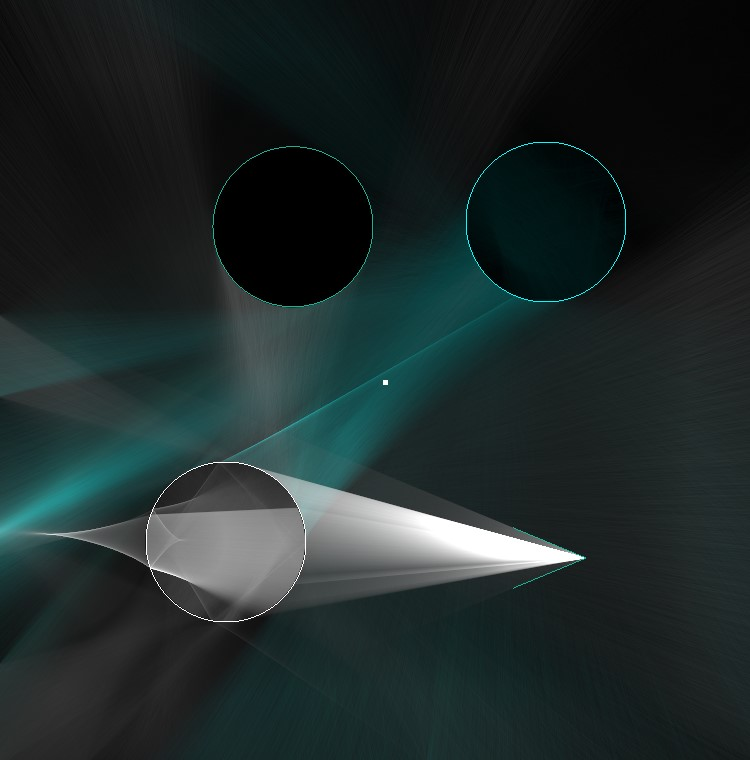

# 2D Pathtracer

Inspired by https://benedikt-bitterli.me/tantalum/


## Geometry

- Bounding Box (Square)
- Sphere (Circle)
- Segment

All geometry types can have a  color.

##  Materials

- Diffuse
- Mirror
- Dielectric (split light into two different directions: reflected and refracted)
- Sampling used from https://benedikt-bitterli.me/tantalum/

## Lights
- Point light (next event estimation)
- Area light (only direct hits)

## JSON Scene Description

The scene description uses the JSON format.
Example:
```json
{
    "geometry": [
        {
            "materialId": 1,
            "type": "segment",
            "a": [37.5,25],
            "b": [37.5,50],
            "color": [1.0,1.0,0.0]
        },
        {
            "materialId": 1,
            "type": "sphere",
            "center": [17.5,37.5],
            "radius": 3
        }
    ],
    "lights": [
        {
            "intensity": [ 100.0, 100.0, 100.0 ],
            "type": "point",
            "pos": [25,40]
        },
    ],
    "camera":
        {
            "pos": [20,20],
            "direction": [0,1],
            "angle": 45,
            "resolution": 5
        },
    "scene_size":
    {
        "size":[50,50]
    }
}
```
###  Geometry Description:
- 'materialID':  1 = Diffuse, 2 = Mirror, 3 = Dielectric
- 'color' field is optional (default is [1,1,1])
- 'type' : 'segment', 'sphere', 'bbox'
- > segment: two points 'a' and 'b' : [x,y]
- > sphere: 'center' : [x,y]  and 'radius' : [x,y]
- > bbox: 'center' : [x,y] and 'size' : [x,y]

###  Light Description
- type: 'point' or 'area'
- position:  
 >  area: two points ("a" : [x,y], "b": [x,y], like segment), point: one point ("pos": [x,y])

### Camera

- position: ("pos") position of camera [x,y]
- direction: in which direction the camera points [x,y] (does not have to be normalized)
- angle : aperture angle of camera [float]
- resolution: for jittering [int]


###  Scene size
Set the size of the rendered area in window [x,y]

##  Features
-  Move Objects with mouse
-  Rotate Camera (R )
-  Change maximum path length (Up and Down Arrow Key)
-  Timelapse Mode (T)
-  Pure Importance Mode (I) (ray not weighted with light ,every ray has color 1)
-  Draw direct illumination rays (D)
-  Change Exposure/Brightness (+/-)
-  Change Scene (S)

## Pathtracing Algorithm

Rays are generated from camera origin and traced forward. At each hit point the direct illumination is collected and the reflectance of the hit point is saved (for an area light the self emitted light is also added to the illumination) . This information is saved for every ray segment. The evaluation of the saved ray segments happens in reverse order. We start at the last hit point and draw a line to the second last hit point using the illumination and reflection factor from the last hit point as color for the line. The color of the line is attenuated by distance. Then the next line starts at the second last hit point and uses as color the illumination + illumination that this point receives from the last hit point. This goes on until we end up at the camera origin. The lines are drawn with the GPU onto a Float framebuffer with additive blending. For rendering the final result we divide each pixel by the number of ray samples. So "a single light path contributes to all pixel estimates" (https://benedikt-bitterli.me/tantalum/). 


